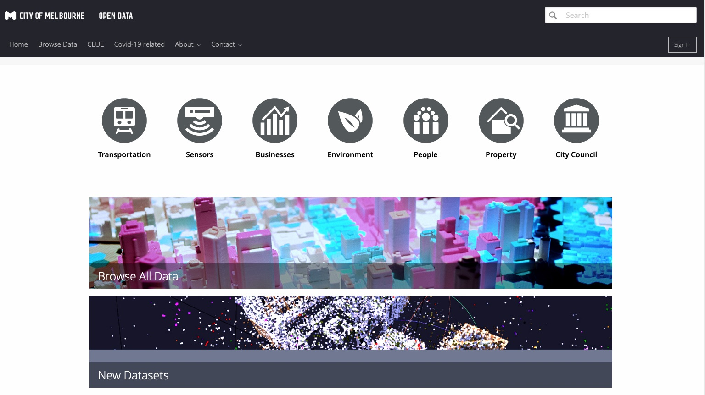

```{r setup, include=FALSE}
options(htmltools.dir.version = FALSE)

knitr::opts_chunk$set(echo = FALSE, fig.retina = 3)


```

```{r xaringan-themer, include=FALSE, warning=FALSE}
library(xaringanthemer)
style_duo_accent(
  primary_color = "#1381B0",
  secondary_color = "#FF961C",
  inverse_header_color = "#FFFFFF"
)
```

```{r}
sensor_readings <- read.csv("Microclimate_Sensor_Readings.csv")
sensor_local <- read.csv("Microclimate_Sensor_Locations.csv")

```

class: inverse, center, middle
.center[
# How does relative humidity change in Melbourne throughout the day and the year? 

]

When is it most uncomfortable to walk around the city (humidity <30% or >60%)?

---
.center[
#Exploring the Data
]
- Data is from the City of Melbourne's Open Data [site](https://data.melbourne.vic.gov.au)



---
.center[
#Exploring the Data
]
Two relevant datasets:

1. [Microclimate Sensor Readings](https://data.melbourne.vic.gov.au/Environment/Microclimate-Sensor-Readings/u4vh-84j8?src=featured_banner)

2. [Microclimate Sensor Locations](https://data.melbourne.vic.gov.au/Environment/Microclimate-Sensor-Locations/irqv-hjr4)
---
.center[
#Microclimate Sensor Readings
]

.pull-left[
About the dataset

```{r}
str(sensor_readings)
```

]

---
.center[
#Data Wrangling
]
---
.center[
#Where are the sensors located?
]
---
.center[
#Humidity - within the day
]
---
.center[
#Humidity - within the year
]
---
.center[
#In conclusion
]


